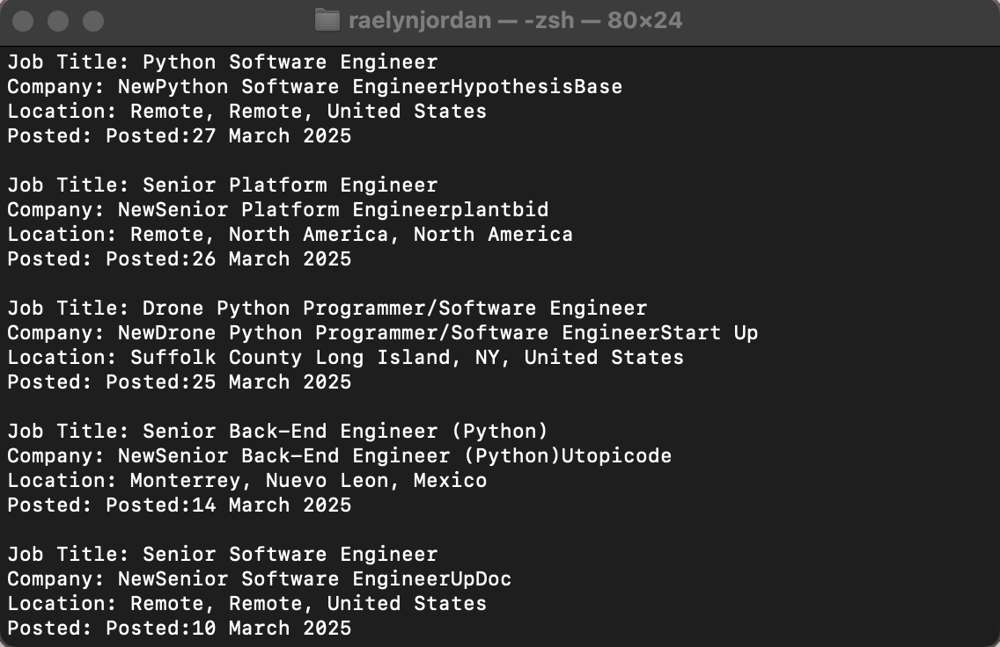

Portfolio
=========

Programming Projects
--------------------

*For access to my private project repositories, please [email me](mailto:rsdixon@csustudent.net?subject=GitHub%20Access) with the subject line, GitHub Access.

---
### [Job Scraper | CSCI 301](project1)

---
### [Battleship Game | CSCI 235](project1)

---

Ethics Papers
-------------

### [The Morris Worm: Its Impact on Cybersecurity, Legal Frameworks, and Ethical Considerations](/pdf/morris_worm_ethics_paper.pdf)

-   **Class:** CSCI.405 – Principles of Cybersecurity  
-   **Grade:** 100

---

Presentations
-------------

### [The Purpose and Use of NIST](/pdf/Presentation1.pdf)

-   **Class:** CSCI.405 – Principles of Cybersecurity  
-   **Grade:** 100

Interview Questions Responses
-------------
### [My Job Interview Responses](/pdf/Interview_Questions_Responses.pdf)

---

Page template forked from <a href="https://github.com/csu-cs/csci-portfolio">CSU-CS</a>

<!-- Remove above link if you don't want to attributive -->
