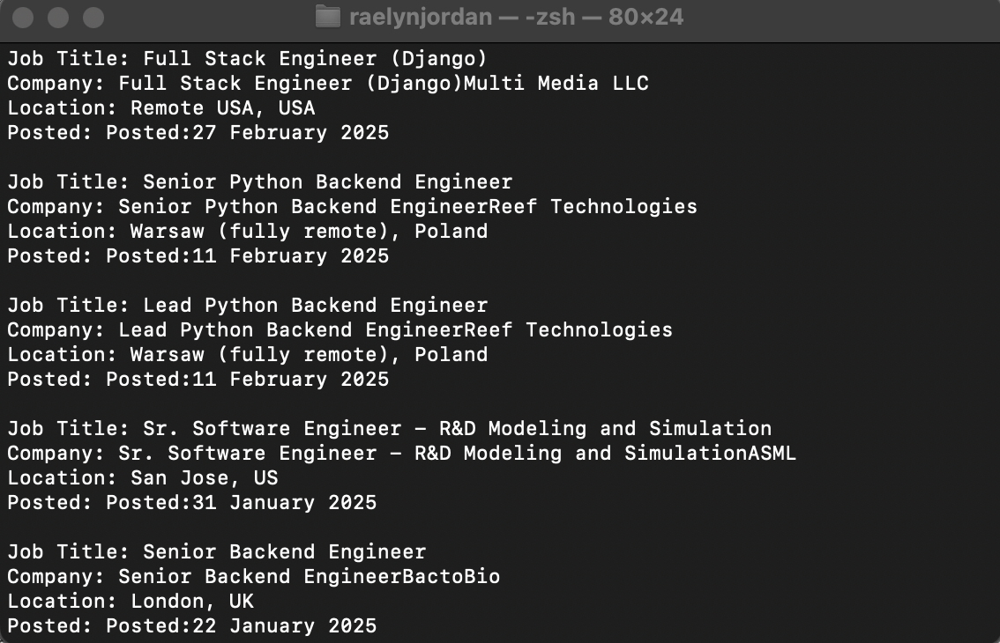
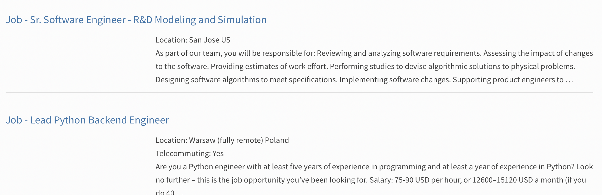

[Back to Portfolio](./)

Python Job Scraper
===============

-   **Class:** CSCI 301 Survey of Scripting Languages
-   **Grade:** 100
-   **Language(s):** Python
-   **Source Code Repository:** [features/mastering-markdown](https://guides.github.com/features/mastering-markdown/)  
    (Please [email me](mailto:rsdixon@csustudent.net?subject=GitHub%20Access) to request access.)

## Project description


This project is a Python-based job scraper that pulls recent Python job listings from the official Python.org job board. It filters job titles based on predefined keywords and outputs details like company name, location, and posting date. This tool is useful for anyone looking for job opportunities related to Python development.

## How to run the program

To run the project, simply execute the Python script in your terminal.
locate the folder the code is in 
``` 
cd ./projectFolder
```

and then run the script:
``` 
python3 jobScraper.py
```

## UI Design

This system operates as a command-line application and does not need any interaction from the user while executing the tasks. It downloads the job information from the Python job board website, sifts through to only include jobs with the details “engineer” in the title, and displays the details of the said jobs (their title, company, location, and date posted) straight into the command-line window.

- The program downloads the most recent job listings from 'https://www.python.org/jobs' when it is launched.

- It incorporates only titles containing “engineer”.

- The program then prints out the relevant details (job title, company name, place, date of posting) of the engineering jobs.


  
Fig 1. The launch screen

  
Fig 2. Example output after input is processed.

  
Fig 3. Feedback when an error occurs.

## 3. Additional Considerations

Sed ut perspiciatis unde omnis iste natus error sit voluptatem accusantium doloremque laudantium, totam rem aperiam, eaque ipsa quae ab illo inventore veritatis et quasi architecto beatae vitae dicta sunt explicabo. 

For more details see [GitHub Flavored Markdown](https://guides.github.com/features/mastering-markdown/).

[Back to Portfolio](./)
