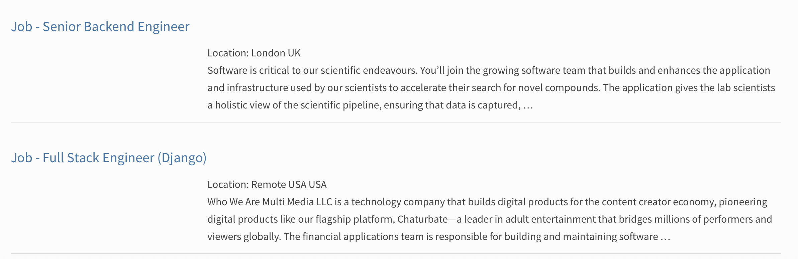

[Back to Portfolio](./)

Python Job Scraper
===============

-   **Class:** CSCI 301 Survey of Scripting Languages
-   **Grade:** 100
-   **Language(s):** Python
-   **Source Code Repository:** [job_scraper.py](https://github.com/rsjordann/job_scraper)
    (Please [email me](mailto:rsdixon@csustudent.net?subject=GitHub%20Access) to request access.)

## Project description


This project is a Python-based job scraper that pulls recent Python job listings from the official Python.org job board. It filters job titles based on predefined keywords and outputs details like company name, location, and posting date. This tool is useful for anyone looking for job opportunities related to Python development.

## How to run the program

To run the project, simply execute the Python script in your terminal.

Locate the folder the file is in:
``` 
cd ./projectFolder
```

and then run the script:
``` 
python3 jobScraper.py
```

## UI Design

This system operates as a command-line application and does not need any interaction from the user while executing the tasks. It downloads the job information from the Python job board website, sifts through to only include jobs with the details “engineer” in the title, and displays the details of the said jobs (their title, company, location, and date posted) straight into the command-line window.

- The program downloads the most recent job listings from 'https://www.python.org/jobs' when it is launched.

- It incorporates only titles containing “engineer”.

- The program then prints out the relevant details (job title, company name, place, date of posting) of the engineering jobs.


  
Fig 1. Example output after the script is processed.

  
Fig 2. Results for engineers on job board

  
Fig 3. Additional results for engineers on job board

## 3. Additional Considerations

One thing to keep in mind when running this program is that it's written to retrieve job postings from the Python job board, and the structure and layout of the webpage could possibly change over time. When the site is updated or the page structure changes, it could possibly break the program. Additionally, this project can be easily extended by allowing the user to choose the keyword for job filtering. This was not a part of my assignment, but it would make it more flexible and easier to customize. Other potential extensions might be to store the job postings in a file, send alerts for specific types of jobs, or even create a job to scrape the site periodically.


[Back to Portfolio](./)
