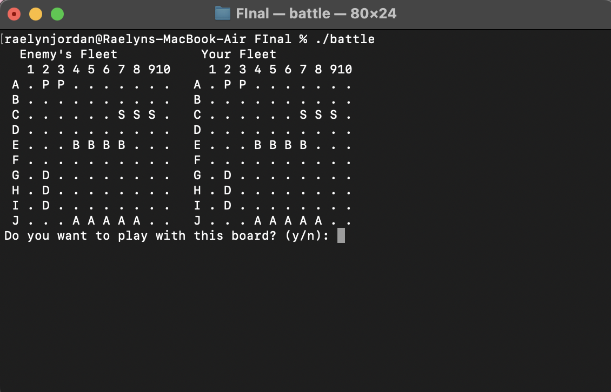
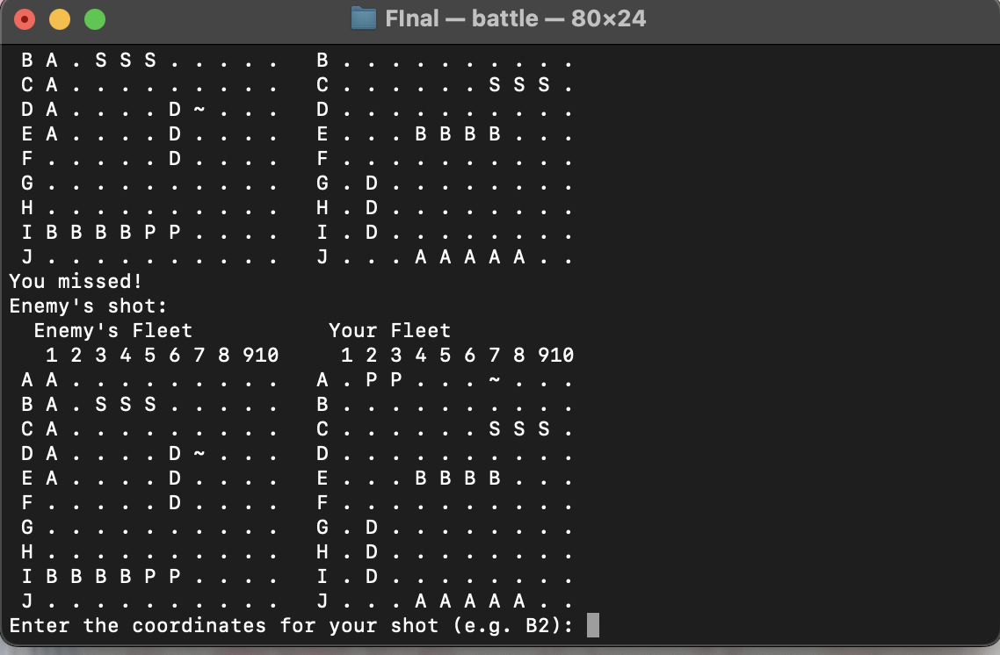
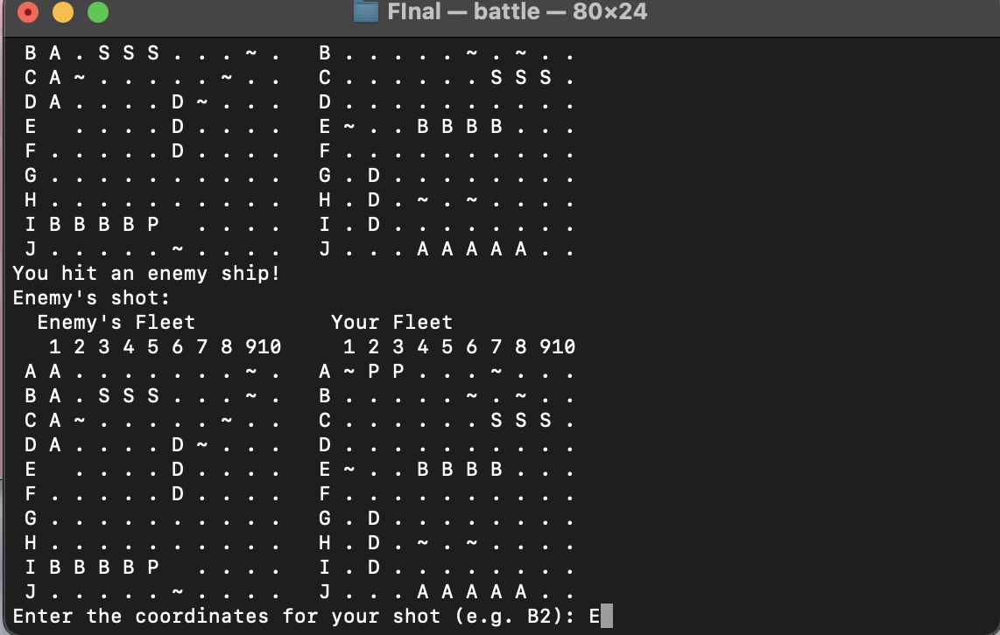

[Back to Portfolio](./)

Battleship Game
===============

-   **Class:** CSCI 235 Procedural Programming
-   **Language(s):** C++
-   **Source Code Repository:** [Battleship.cpp](https://rsjordann.github.ip/project2codes/Battleship.cpp)  

    (Please [email me](mailto:rsdixon@csustudent.net?subject=GitHub%20Access) to request access.)

## Project description

The Battleship game is an implementation of a board game in which players try to sink their opponents ships, all conducted through command line input. This was a C++ project I completed for my CSCI 235 Procedural Programming course. It emulates the process in which players alternate turns in an attempt to 'sink' their opponents ships before they are sunk themselves.  

Key Features:

- Supports 2 players

- Users receive feedback for each move made alongside board representation.  

- Ships are placed on the board automatically.  


## How to compile and run the program

To compile and run the Battleship game, follow these steps:

1. Navigate to the project directory:
    ```terminal
    cd ./BattleshipGame
    ```

2. Compile the C++ code:
    ```terminal
    g++ -o battleship main.cpp
    ```

3. Run the compiled program:
    ```terminal
    ./battleship
    ```

## UI Design

The game is a text-based, command-line application. Users will:
- Start the game by running the compiled program.
- Input coordinates to make moves and try to sink the opponent’s ships.
- View updated boards after each turn, displaying hits or misses.

  
Fig 1. Start of game once compiled

  
Fig 2. Feedback of missed shot

  
Fig 3. Feedback when enemy is hit

## 3. Additional Considerations

The game assumes that players will always input valid coordinates. In the future, I could improve the user experience by:
   - Adding input validation to ensure that players can't accidentally input invalid coordinates (i.e. out-of-bounds or non-numeric input).
   - Providing error messages to guide the player when mistakes occur.
     
[Back to Portfolio](./)
